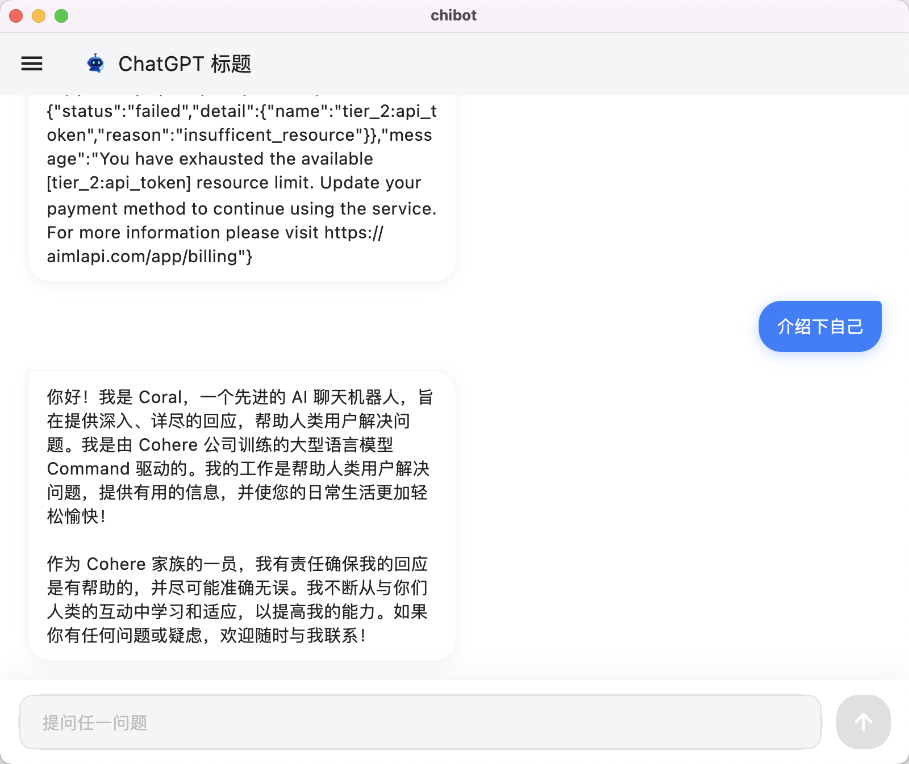

# Chi Chatbot


  
A sophisticated cross-platform AI chatbot application built with Flutter that supports multiple AI providers including OpenAI, Google Gemini, and Anthropic Claude. Features text and image generation capabilities with a clean, modern interface.

## Screenshots



## 🚀 Features

- **Multi-Provider Support**: OpenAI, Google Gemini, Anthropic Claude, and custom AI models
- **Real-time Streaming**: Live response streaming for OpenAI and Claude
- **Image Generation**: AI-powered image creation (DALL-E, Gemini, etc.)
- **Web Search**: Integrated web search capabilities (Tavily, Bing)
- **Session Management**: Persistent conversation history
- **Desktop Integration**: System tray, window management, context menus
- **Multi-language Support**: English, Chinese, German, French, Japanese
- **Responsive Design**: Adaptive UI for all screen sizes
- **Customizable Settings**: API keys, model selection, provider URLs, system prompts
- **Cross-platform**: iOS, Android, macOS, Windows, Linux, Web

## 🛠️ Quick Start

### Prerequisites

- Flutter SDK (3.0.0 or later)
- Dart SDK (2.17.0 or later)
- Platform-specific development tools

### Installation

1. **Clone the repository**
   ```bash
   git clone https://github.com/mutse/chibot.git
   cd chibot
   ```

2. **Install dependencies**
   ```bash
   flutter pub get
   ```

3. **Configure API keys**
   - Launch the application
   - Navigate to Settings
   - Add your API keys for desired providers:
     - OpenAI API Key
     - Google Gemini API Key
     - Anthropic Claude API Key

4. **Run the application**
   ```bash
   # Mobile
   flutter run

   # Desktop (macOS)
   flutter run -d macos

   # Web
   flutter run -d chrome
   ```

## 🏗️ Architecture

The application follows a clean architecture pattern with clear separation of concerns:

### Core Components

- **State Management**: Provider pattern for reactive state management
- **Service Layer**: Clean API abstractions for each AI provider
- **Repository Pattern**: Data persistence and session management
- **Model Layer**: Type-safe data structures with JSON serialization

### Project Structure

```
lib/
├── main.dart                 # Application entry point
├── providers/               # State management
│   ├── settings_provider.dart # App configuration & API keys
│   └── chat_provider.dart    # Chat session management
├── services/                # Business logic & APIs
│   ├── base_api_service.dart  # Abstract base with retry logic
│   ├── openai_service.dart    # OpenAI GPT implementation
│   ├── gemini_service.dart    # Google Gemini implementation
│   ├── claude_service.dart    # Anthropic Claude implementation
│   ├── chat_service_factory.dart # Service creation factory
│   ├── service_manager.dart   # Integrated service management
│   ├── image_generation_service.dart # Image creation
│   ├── chat_session_service.dart     # Conversation persistence
│   ├── image_session_service.dart    # Image history
│   ├── web_search_service.dart       # Web search integration
│   └── image_save_service.dart       # Device storage
├── models/                  # Data structures
│   ├── chat_message.dart    # Core message structure
│   ├── chat_session.dart    # Conversation sessions
│   ├── image_session.dart   # Image generation sessions
│   └── image_message.dart   # Image content messages
├── screens/                 # UI components
│   ├── chat_screen.dart     # Main chat interface
│   ├── settings_screen.dart # Configuration UI
│   └── about_screen.dart    # App information
├── l10n/                    # Localization
│   ├── app_en.arb          # English
│   ├── app_zh.arb          # Chinese
│   ├── app_de.arb          # German
│   ├── app_fr.arb          # French
│   └── app_ja.arb          # Japanese
└── utils/                   # Utilities
    ├── constants.dart      # App configuration
    └── validators.dart     # Input validation
```

## 🔑 API Configuration

### Supported Providers

1. **OpenAI**
   - Models: GPT-4, GPT-4o, GPT-4-turbo, GPT-3.5-turbo
   - Features: Text generation, streaming responses, function calling

2. **Google Gemini**
   - Models: Gemini 2.0 Flash, Gemini 2.5 Pro, Gemini 1.5 Pro
   - Features: Text, vision, and multimodal capabilities

3. **Anthropic Claude**
   - Models: Claude 3.5 Sonnet, Claude 3.5 Haiku, Claude 3 Opus
   - Features: Advanced reasoning, streaming support, tool use

### Custom Providers

Configure custom providers through the Settings screen:
- Custom base URLs
- Custom model names
- Provider-specific configurations

## 🌍 Internationalization

The app supports multiple languages:
- **English** (en)
- **Chinese** (zh)
- **German** (de)
- **French** (fr)
- **Japanese** (ja)

Add new languages by:
1. Creating new `.arb` files in `lib/l10n/`
2. Adding translations following the existing format
3. Updating the app's supported locales in `main.dart`

## 🧪 Development

### Available Commands

```bash
# Development
flutter run                    # Run on connected device
flutter run -d macos          # Run specifically on macOS
flutter run -d chrome         # Run on web browser

# Code Quality
flutter analyze               # Run static analysis using flutter_lints
flutter test                  # Run unit and widget tests
flutter pub deps              # Show dependency tree
flutter clean                 # Clean build artifacts

# Building
flutter build apk             # Build Android APK
flutter build ipa             # Build iOS app bundle
flutter build macos           # Build macOS app
flutter build web             # Build web version

# Code Generation
flutter pub run build_runner build    # Generate code (if using code generation)
flutter pub run flutter_launcher_icons # Generate app icons
```

### Testing

#### Run Tests

```bash
# Run all tests
flutter test

# Run with coverage
flutter test --coverage

# Run specific test file
flutter test test/services/openai_service_test.dart
```

#### Test Structure

- **Unit Tests**: Service layer and business logic
- **Widget Tests**: UI components and interactions
- **Integration Tests**: Complete user flows

### Debugging

```bash
# Debug mode
flutter run --debug

# Profile mode
flutter run --profile

# Verbose logging
flutter run --verbose
```

## 📦 Deployment

### Mobile Deployment

#### Android
```bash
flutter build apk --release
flutter build appbundle --release
```

#### iOS
```bash
flutter build ipa --release
```

### Desktop Deployment

#### macOS
```bash
flutter build macos --release
```

#### Windows
```bash
flutter build windows --release
```

#### Linux
```bash
flutter build linux --release
```

### Web Deployment

```bash
flutter build web --release
```

## 🚀 Advanced Configuration

### Environment Variables

Set these environment variables for development:

```bash
# Development overrides
export OPENAI_API_KEY="your-openai-key"
export GEMINI_API_KEY="your-gemini-key"
export CLAUDE_API_KEY="your-claude-key"
```

### Custom Models

To add support for new AI models:

1. **Extend Base Service**
   ```dart
   class CustomService extends BaseApiService {
     // Implement required methods
   }
   ```

2. **Update Service Factory**
   ```dart
   // Add to ChatServiceFactory.create()
   ```

3. **Add Settings Support**
   ```dart
   // Update SettingsProvider with new model options
   ```

## 🤝 Contributing

We welcome contributions! Please follow these steps:

1. **Fork the repository**
2. **Create a feature branch**
   ```bash
   git checkout -b feature/amazing-feature
   ```

3. **Make your changes**
4. **Run tests and linting**
   ```bash
   flutter analyze
   flutter test
   ```

5. **Commit your changes**
   ```bash
   git commit -m 'Add amazing feature'
   ```

6. **Push to the branch**
   ```bash
   git push origin feature/amazing-feature
   ```

7. **Open a Pull Request**

### Code Style

- Follow existing patterns in the codebase
- Use Provider for state management
- Maintain clean separation between UI and business logic
- Implement proper error handling with user-friendly messages
- Add comprehensive documentation for public APIs

## 🐛 Troubleshooting

### Common Issues

1. **Build Failures**
   ```bash
   flutter clean
   flutter pub get
   flutter pub upgrade
   ```

2. **API Key Issues**
   - Verify API keys are correctly entered in Settings
   - Check provider-specific rate limits
   - Ensure network connectivity

3. **Desktop Issues**
   - For macOS: Ensure Xcode command line tools are installed
   - For Windows: Ensure Visual Studio build tools are installed
   - For Linux: Ensure necessary development packages are installed

### Getting Help

- **GitHub Issues**: Create an issue for bugs or feature requests
- **Documentation**: Check existing docs and README
- **Community**: Join the discussion in GitHub Discussions

## 📄 License

This project is licensed under the MIT License - see the [LICENSE](LICENSE) file for details.

## 🙏 Acknowledgments

- **Flutter Team**: For the amazing cross-platform framework
- **AI Providers**: OpenAI, Google, Anthropic for their powerful APIs
- **Open Source Community**: For inspiration and contributions
- **Contributors**: Everyone who has contributed to this project

## 📞 Support

For support and questions:
- **GitHub Issues**: [Create an issue](https://github.com/mutse/chibot/issues)
- **Documentation**: Check the [wiki](https://github.com/mutse/chibot/wiki)
- **Email**: Contact the maintainers

---

**Made with ❤️ by the Chi Chatbot Team**