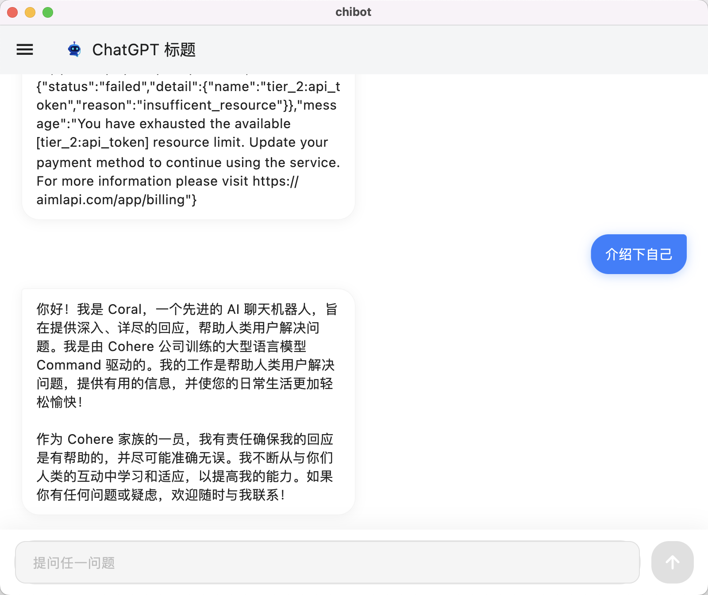

# Chi Chatbot


  
Chi Chatbot AI 是一个基于 Flutter 的跨平台应用程序，它提供了一个直观的聊天界面，用于与 AI 语言模型进行交互。目前通过统一的界面支持集成 OpenAI 模型（如 GPT-4）和 Google Gemini 模型。

## 截图



## 功能特性
  
- **多提供商支持**：同时支持 OpenAI 和 Google Gemini AI 模型
- **流式输出**：AI 模型的实时响应
- **文本生成图像**：基于文本提示生成图像
- **网络搜索**：通过网络搜索在线生成文本
- **简洁的聊天界面**：用户友好的界面，用于发送消息和查看 AI 响应
- **可自定义设置**：配置 API 密钥、模型选择和提供商 URL
- **跨平台**：使用 Flutter 构建，兼容多个平台
  
## 架构
  
Chi AI Chatbot 遵循清晰的架构设计，在展示层、状态管理和服务层之间有明确的分离：
  
- **展示层**：聊天和设置界面的 UI 组件
- **状态管理**：使用 Provider 模式管理应用程序状态
- **服务层**：与不同 AI 提供商通信的抽象层
  
## 快速开始
  
### 前置要求
  
- Flutter SDK
- Dart
- OpenAI 或 Google Gemini 的 API 密钥
  
### 安装步骤
  
1. 克隆仓库：

    ```zsh
    $ git clone https://github.com/mutse/chibot.git
    ```

2. 进入项目目录：

    ```zsh
    $ cd chibot
    ```

3. 安装依赖：

    ```zsh
    $ flutter pub get
    ```

4. 运行应用程序：

    ```zsh
    $ flutter run
    ```

### 配置

1. 启动应用程序
2. 导航到设置
3. 输入您的 OpenAI 或 Google Gemini API 密钥
4. 选择您偏好的 AI 模型
5. （可选）如需要，配置自定义提供商 URL

## 项目结构

    ```zsh
    lib/
    ├── main.dart # 应用程序入口点
    ├── models/
    │ └── chat_message.dart # 聊天消息的数据模型
    ├── providers/
    │ └── settings_provider.dart # 应用设置的状态管理
    ├── screens/
    │ ├── chat_screen.dart # 主聊天界面
    │ └── settings_screen.dart # 设置配置
    └── services/
    └── openai_service.dart # AI 提供商通信服务
    ```

## 支持平台
  
- macOS
- iOS 
- Android
- Web（可能支持）
- Windows 
- Linux
  
## 技术栈
  
- **Flutter**：跨平台 UI 框架
- **Dart**：编程语言
- **Provider**：状态管理解决方案
- **HTTP 客户端**：用于与 AI 提供商进行 API 通信
  
## 许可证
  
本项目采用 MIT [许可证](./LICENSE) - 详情请查看 LICENSE 文件。
  
## 作者
  
Mutse Young © 2025